# enoca™ AI Otomasyon Sistemi — Detaylı Kullanıcı Dokümantasyonu

**Versiyon:** 2.0  
**Tarih:** 6 Temmuz 2026  
**Hazırlayan:** enoca™ Analiz ve AR-GE Ekibi  
**Platform:** n8n + Google Gemini AI Agents  
**Hedef Kitle:** Teknik ekipler, ürün yöneticileri, operasyon kullanıcıları

---

## İçindekiler

1. [Doküman Hakkında](#1-doküman-hakkında)
2. [Sistem Nedir?](#2-sistem-nedir)
3. [Teknoloji Yığını ve Mimari](#3-teknoloji-yığını-ve-mimari)
4. [Kurulum Rehberi](#4-kurulum-rehberi)
5. [n8n Arayüzü ile Tanışma](#5-n8n-arayüzü-ile-tanışma)
6. [Workflow Nedir ve Nasıl Çalışır?](#6-workflow-nedir-ve-nasıl-çalışır)
7. [Mevcut AI Otomasyonlarının Detaylı Anlatımı](#7-mevcut-ai-otomasyonlarının-detaylı-anlatımı)
   - 7.1 [KEP (Kurumsal E-Ticaret Platformu)](#71-kep-kurumsal-e-ticaret-platformu)
   - 7.2 [Connector](#72-connector)
   - 7.3 [EnoPrice](#73-enoprice)
   - 7.4 [EnoRep](#74-enorep)
   - 7.5 [EnoCart](#75-enocart)
8. [Workflow'ları n8n'e Yükleme ve Test Etme](#8-workflowları-n8ne-yükleme-ve-test-etme)
9. [Güvenlik ve En İyi Uygulamalar](#9-güvenlik-ve-en-iyi-uygulamalar)
10. [Hata Ayıklama ve Loglama](#10-hata-ayıklama-ve-loglama)
11. [Sık Sorulan Sorular](#11-sık-sorulan-sorular)
12. [Ekler](#12-ekler)

---

## 1. Doküman Hakkında

Bu doküman, **enoca™ AI Otomasyon Sistemi**'nin n8n tabanlı altyapısını, herkesin anlayabileceği bir dille anlatır. Kurulumdan başlayarak; her workflow'un ne iş yaptığına, nasıl çalıştığına, hangi ekranlardan yönetildiğine ve olası sorunlarda neler yapılacağına kadar adım adım rehberlik eder.

Dokümanın amacı:
- Yeni katılan ekip üyelerinin sistemi hızla öğrenmesini sağlamak
- Operasyon kullanıcılarının workflow'ları izlemesini ve yönetmesini kolaylaştırmak
- Geliştiricilere mevcut otomasyonların mimarisini ve entegrasyon noktalarını göstermek
- Yöneticilere sistemden elde edilebilecek faydaları ve KPI'ları aktarmak

> **Önemli Not:** Bu doküman, mevcut `ENOCA_AI_Otomasyon_Dokumantasyonu.md` (versiyon 1.0) dosyasının daha görsel, daha anlaşılır ve uygulamaya dönük genişletilmiş halidir. İki doküman birlikte kullanılmalıdır.

---

## 2. Sistem Nedir?

enoca™ AI Otomasyon Sistemi, şirketin e-ticaret ekosistemindeki tekrarlayan, manuel veya karar gerektiren işleri **n8n** workflow motoru ve **Google Gemini** yapay zeka modelleri ile otomatikleştiren bir platformdur.

### 2.1 Ekosistemdeki Projeler

| Proje | Açıklama | Örnek AI Otomasyonları |
|-------|----------|------------------------|
| **KEP** | Kurumsal E-Ticaret Platformu (merkezi) | Akıllı sipariş işleme, müşteri segmentasyonu, stok/restok, güvenlik audit |
| **Connector** | Pazaryeri entegrasyon katmanı | Ürün eşleştirme, stok senkronizasyonu |
| **EnoPrice** | Dinamik fiyatlandırma motoru | Rakip fiyat izleme, fiyat önerileri |
| **EnoRep** | Ürün öneri ve kişiselleştirme motoru | Sepet terk emaili, churn önleme |
| **EnoCart** | Akıllı alışveriş arabası / IoT | Hırsızlık/sahtekarlık tespiti |

### 2.2 Sistemden Beklenen Faydalar

| Fayda | Örnek Etki |
|-------|------------|
| Hız | Sipariş işleme süresi 4.2 dakikadan 8 saniyeye düşer |
| Doğruluk | Sahte sipariş tespiti %60'tan %95'e çıkar |
| Maliyet | Manuel işlem yükünde %30-50 tasarruf |
| Kişiselleştirme | Dönüşüm oranında %25-35 artış |
| Ölçeklenebilirlik | Artan işlem hacmi otomatik karşılanır |

### 2.3 Temel Çalışma Prensibi

Bütün otomasyonlar şu kalıbı izler:

1. **Tetikleyici (Trigger):** Bir olay gerçekleşir (yeni sipariş, saat vurur, sensör verisi gelir).
2. **Veri Toplama:** İlgili veriler veritabanından veya API'den çekilir.
3. **AI Analizi:** Google Gemini modeli veriyi yorumlar, skorlar veya öneriler üretir.
4. **Karar:** Risk skoru, segment, fark oranı gibi kriterlere göre yol belirlenir.
5. **Aksiyon:** Onay, red, bildirim, güncelleme, email gönderme gibi işlemler yapılır.
6. **Loglama:** Sonuç kaydedilir ve izlenebilir hale gelir.

---

## 3. Teknoloji Yığını ve Mimari

### 3.1 Kullanılan Teknolojiler

| Katman | Teknoloji | Görevi |
|--------|-----------|--------|
| Workflow Motoru | n8n | Otomasyonların tasarlanması ve çalıştırılması |
| Veritabanı | PostgreSQL 16 | n8n metadata ve iş verilerinin saklanması |
| Kuyruk/Önbellek | Redis 7 | Ölçeklenebilirlik ve iş kuyruğu |
| AI Modeli | Google Gemini (`gemini-2.0-flash`) | Doğal dil analizi, karar desteği, içerik üretimi |
| IoT Mesajlaşma | MQTT | EnoCart sensör verisi iletişimi |
| İzleme (Opsiyonel) | Prometheus + Grafana | Sistem metrikleri ve dashboard |
| Konteynerizasyon | Docker Compose | Tüm servislerin tek komutla ayağa kaldırılması |

### 3.2 Genel Mimari Diyagramı

Aşağıdaki diyagram, verinin sisteme nasıl girdiğini, AI katmanında nasıl işlendiğini ve dış sistemlere nasıl aktarıldığını gösterir.

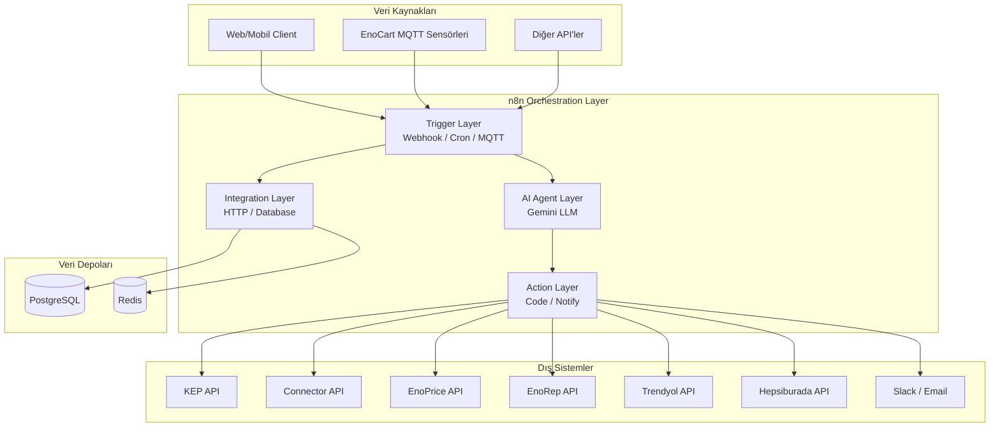
```mermaid
flowchart TB
    subgraph Kaynaklar["Veri Kaynakları"]
        Web[Web/Mobil Client]
        MQTT[EnoCart MQTT Sensörleri]
        API[Diğer API'ler]
    end

    subgraph n8nKatmanı["n8n Orchestration Layer"]
        Trigger[Trigger Layer<br/>Webhook / Cron / MQTT]
        AI[AI Agent Layer<br/>Gemini LLM]
        Integration[Integration Layer<br/>HTTP / Database]
        Action[Action Layer<br/>Code / Notify]
    end

    subgraph Veri["Veri Depoları"]
        PG[(PostgreSQL)]
        Redis[(Redis)]
    end

    subgraph Dis["Dış Sistemler"]
        KEP[KEP API]
        Connector[Connector API]
        EnoPrice[EnoPrice API]
        EnoRep[EnoRep API]
        Trendyol[Trendyol API]
        HB[Hepsiburada API]
        Slack[Slack / Email]
    end

    Web --> Trigger
    MQTT --> Trigger
    API --> Trigger
    Trigger --> AI
    Trigger --> Integration
    AI --> Action
    Integration --> PG
    Integration --> Redis
    Action --> KEP
    Action --> Connector
    Action --> EnoPrice
    Action --> EnoRep
    Action --> Trendyol
    Action --> HB
    Action --> Slack
```

### 3.3 Supervisor Agent Deseni

Sistemdeki karmaşık görevler bir **Supervisor Agent** tarafından alt agentlara dağıtılır. Her alt agent bir projeye özeldir.

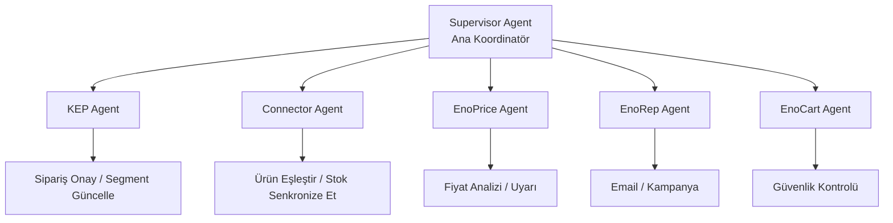
```mermaid
flowchart TD
    S[Supervisor Agent<br/>Ana Koordinatör]
    S --> KEP[KEP Agent]
    S --> CONN[Connector Agent]
    S --> PRICE[EnoPrice Agent]
    S --> REP[EnoRep Agent]
    S --> CART[EnoCart Agent]

    KEP --> KEP_Aksiyon[Sipariş Onay / Segment Güncelle]
    CONN --> CONN_Aksiyon[Ürün Eşleştir / Stok Senkronize Et]
    PRICE --> PRICE_Aksiyon[Fiyat Analizi / Uyarı]
    REP --> REP_Aksiyon[Email / Kampanya]
    CART --> CART_Aksiyon[Güvenlik Kontrolü]
```

### 3.4 Docker Compose Servisleri

`n8n-docker/docker-compose.yml` dosyasında şu servisler tanımlıdır:

- **n8n:** Ana uygulama, 5678 portunda çalışır.
- **postgres:** n8n metadata ve workflow verileri burada saklanır.
- **redis:** İleride worker moduna geçildiğinde kuyruk görevi görür.
- **n8n_worker:** Opsiyonel ölçeklendirme servisi (şu anda `replicas: 0`).
- **prometheus & grafana:** Opsiyonel izleme profili ( `--profile monitoring` ile aktif olur).

Servislerin birbiriyle sağlıklı çalışması için `depends_on` ve `healthcheck` tanımları kullanılmıştır.

---

## 4. Kurulum Rehberi

Bu bölüm, sistemi sıfırdan çalışır hale getirmek için gereken adımları gösterir.

### 4.1 Ön Koşullar

Bilgisayarınızda aşağıdaki araçların kurulu olması gerekir:

- [Docker](https://docs.docker.com/get-docker/)
- [Docker Compose](https://docs.docker.com/compose/install/)
- İnternet bağlantısı (Gemini API ve harici servisler için)

Kontrol komutu:

```bash
docker --version
docker-compose --version
```

### 4.2 Proje Klasörüne Gitmek

Terminalde projenin `n8n-docker` klasörüne gidin:

```bash
cd /Users/osmancagrigenc/Downloads/Enoca Projects/n8n-docker
```

### 4.3 Çevre Değişkenlerini Hazırlamak

`.env.example` dosyasını `.env` olarak kopyalayın:

```bash
cp .env.example .env
```

Ardından `.env` dosyasını bir metin editörüyle açın ve aşağıdaki alanları kendi değerlerinizle doldurun:

| Değişken | Açıklama | Örnek |
|----------|----------|-------|
| `AI_GEMINI_API_KEY` | Google Gemini API anahtarı | `AIzaSy...` |
| `KEP_API_KEY` | KEP API anahtarı | `kep_live_...` |
| `CONNECTOR_API_KEY` | Connector API anahtarı | `conn_live_...` |
| `ENOPRICE_CLIENT_ID` / `ENOPRICE_CLIENT_SECRET` | EnoPrice OAuth bilgileri | `...` |
| `ENOREP_API_KEY` | EnoRep API anahtarı | `enorep_live_...` |
| `TRENDYOL_API_KEY` | Trendyol entegrasyon anahtarı | `...` |
| `HEPSIBURADA_API_KEY` | Hepsiburada entegrasyon anahtarı | `...` |
| `SMTP_PASSWORD` | Email bildirimleri için SMTP şifresi | `...` |
| `SLACK_WEBHOOK_URL` | Slack bildirimleri için webhook URL | `https://hooks.slack.com/...` |

> **Güvenlik Uyarısı:** `.env` dosyası hassas bilgiler içerir. Bu dosyayı asla GitHub'a göndermeyin. Proje kökünde bir `.gitignore` dosyası oluşturup `.env` satırı ekleyin.

### 4.4 Servisleri Başlatmak

Aşağıdaki komutla n8n, PostgreSQL ve Redis servislerini arka planda başlatın:

```bash
docker-compose up -d
```

İlk başlatma 1-2 dakika sürebilir. Servislerin sağlıklı olduğunu kontrol etmek için:

```bash
docker-compose ps
```

Çıktıda `enoca_n8n`, `enoca_n8n_postgres` ve `enoca_n8n_redis` konteynerlerinin `Up (healthy)` durumunda olduğundan emin olun.

### 4.5 n8n Arayüzüne Girmek

Tarayıcınızda şu adresi açın:

```
http://localhost:5678
```

İlk kurulumda aşağıdaki gibi bir **Sign in** ekranı ile karşılaşacaksınız:

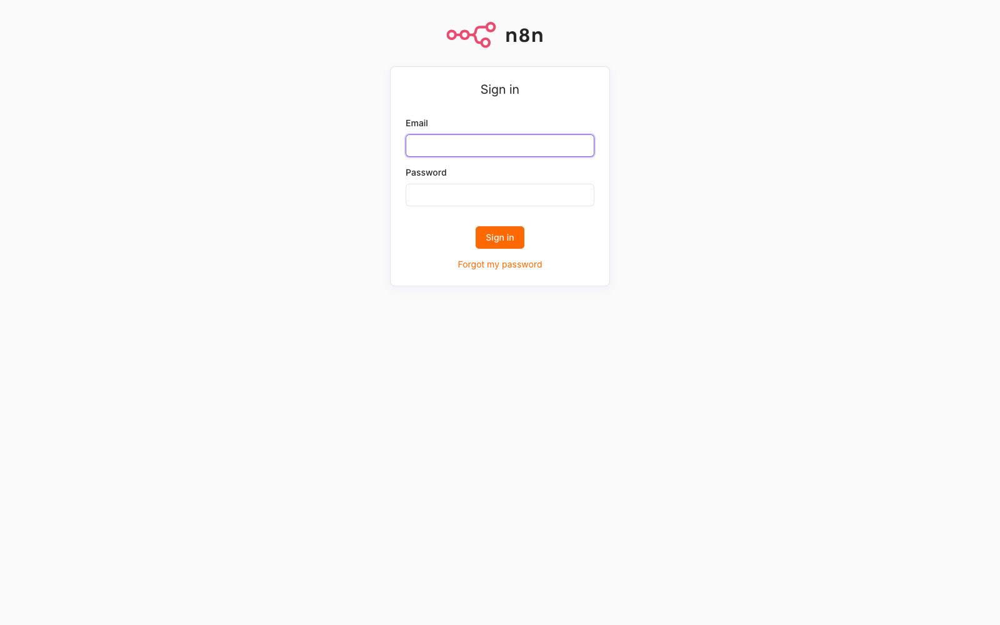

Kurulum sırasında belirlediğiniz e-posta ve şifreyle giriş yapın.

### 4.6 İlk Kurulum Sonrası Karşılama Ekranı

Giriş yaptıktan sonra n8n size kısa bir tanıtım ekranı gösterebilir. "Get started" veya "Skip" seçenekleriyle bu adımı geçebilirsiniz. Sonrasında karşınıza **Dashboard** çıkar:

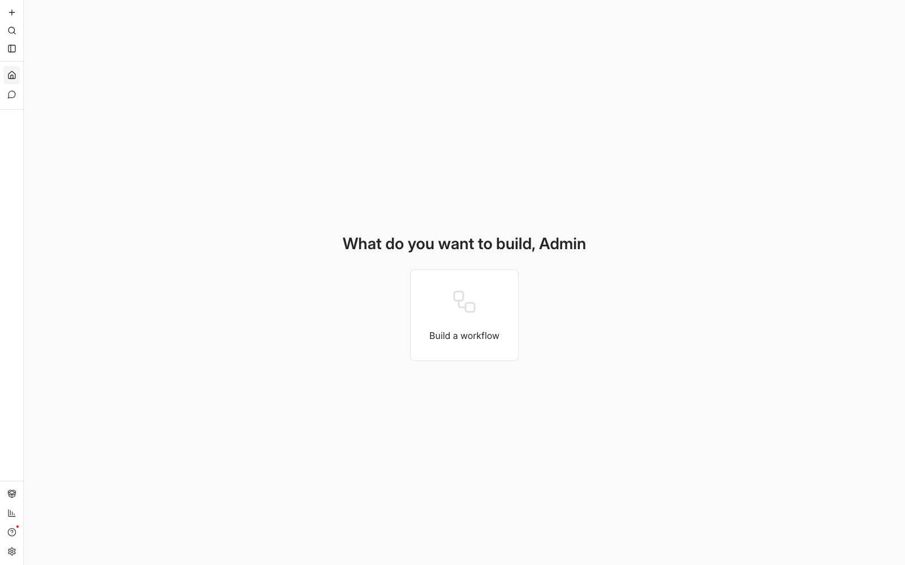

Dashboard üzerinde "Build a workflow" kartına tıklayarak yeni bir workflow oluşturabilirsiniz.

### 4.7 Monitoring Profili ile Çalıştırmak (İsteğe Bağlı)

Prometheus ve Grafana ile izleme yapmak isterseniz:

```bash
docker-compose --profile monitoring up -d
```

> **Not:** Bu profil için `n8n-docker/prometheus/prometheus.yml` dosyasının oluşturulması gerekir. Mevcut yapılandırmada bu dosya eksiktir.

### 4.8 Servisleri Durdurmak

```bash
docker-compose down
```

Verileri silmeden durdurmak için yukarıdaki komut yeterlidir. Docker volume'ları silmek isterseniz:

```bash
docker-compose down -v
```

---

## 5. n8n Arayüzü ile Tanışma

n8n, otomasyonları görsel olarak tasarlayabileceğiniz bir "canvas" (tuval) arayüzü sunar. Bu bölümde sık kullanılan ekranları tanıyacağız.

### 5.1 Dashboard (Ana Sayfa)

Dashboard, sisteme giriş yaptıktan sonra gördüğünüz ilk ekrandır. Son workflow'lar, çalıştırma istatistikleri ve hızlı erişim bağlantıları burada yer alır.


**Dashboard'dan yapabilecekleriniz:**
- Yeni workflow oluşturmak
- Mevcut workflow'lara gitmek
- Son çalıştırmaları görmek
- Şablonlardan workflow oluşturmak

### 5.2 Workflows Listesi

Sol menüdeki **Workflows** ikonuna tıklayarak tüm workflow'ları listeleyebilirsiniz.


Bu ekranda:
- Workflow adlarını görebilir
- Etiketlere (tags) göre filtreleyebilir
- Aktif/pasif durumlarını kontrol edebilir
- Son çalışma zamanlarını görebilirsiniz.

### 5.3 Workflow Editor (Tasarım Ekranı)

Yeni workflow oluşturduğunuzda veya mevcut bir workflow'a tıkladığınızda **Editor** ekranı açılır.

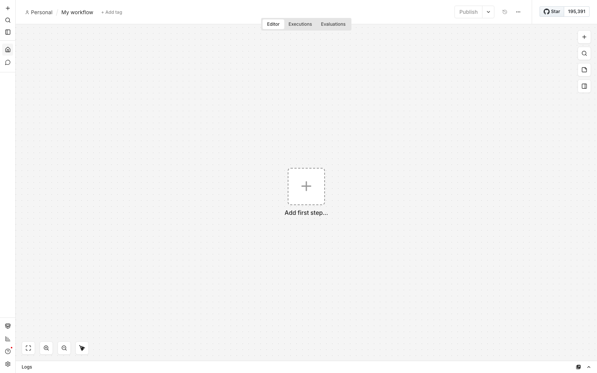

Editörde şöyle bir yapı vardır:

| Bölüm | Açıklama |
|-------|----------|
| **Tuval (Canvas)** | Ortadaki noktalı alan. Node'ları sürükleyip bırakarak workflow'u tasarladığınız yer. |
| **Add first step** | Workflow'a ilk node'u eklemek için kullanılan buton. |
| **Üst Menü** | Publish, Executions, Evaluations, workflow adı, tag ekleme. |
| **Sağ Panel** | Zoom, fit, node paneli, sticky note gibi araçlar. |
| **Sol Kenar Çubuğu** | Ana menü (Dashboard, Workflows, Executions, Settings). |

### 5.4 Node Ekleme Paneli

"Add first step" butonuna tıkladığınızda karşınıza yüzlerce node seçeneği çıkar. Kullandığımız temel node'lar şunlardır:

- **Trigger:** Webhook, Schedule (Cron), MQTT
- **AI:** AI Agent, AI Language Model
- **Data:** Code, Postgres, HTTP Request
- **Messaging:** Slack, Email Send
- **Logic:** Switch, Filter, IF, Merge

### 5.5 Executions (Çalıştırma Geçmişi)

Sol menüden **Executions** seçeneğine giderek workflow'ların ne zaman çalıştığını, başarılı mı yoksa hatalı mı bittiğini görebilirsiniz.

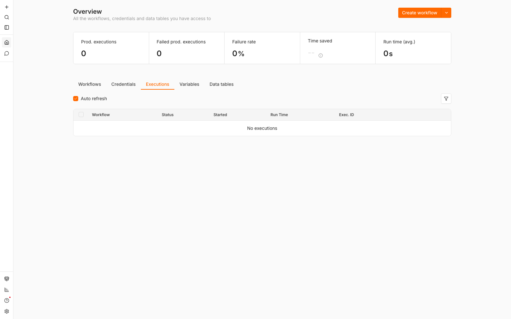

Her satırda:
- Workflow adı
- Başlangıç/bitiş zamanı
- Çalışma süresi
- Durum (Success, Error, Waiting, Running)
- Trigger tipi

görünür. Hatalı bir çalışmaya tıklayarak hangi node'da hata aldığını ve hata mesajını detaylı görebilirsiniz.

### 5.6 Settings (Ayarlar)

Sol menünün en altındaki **Settings** ikonuna tıklayarak:

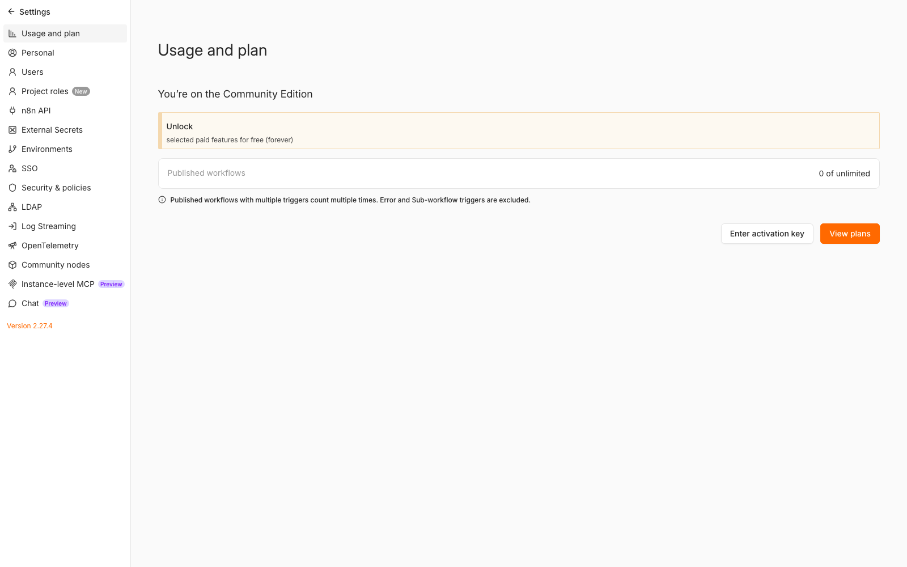

- Kullanıcı hesabınızı yönetebilir
- API anahtarları oluşturabilir
- Credential'ları (API key, OAuth, MQTT gibi) tanımlayabilir
- Genel n8n ayarlarını değiştirebilirsiniz.

**Credential yönetimi özellikle önemlidir.** Workflow'lardaki API anahtarları doğrudan JSON dosyalarına yazılmamalı, bunun yerine n8n Settings > Credentials bölümünde güvenli bir şekilde saklanmalıdır.

---

## 6. Workflow Nedir ve Nasıl Çalışır?

### 6.1 Workflow Tanımı

**Workflow**, belirli bir işi otomatikleştiren node'ların (düğümlerin) bir araya gelmesidir. Her node bir adımı temsil eder. Node'lar arasındaki bağlantılar verinin akış yönünü gösterir.

Bir workflow tipik olarak şunlardan oluşur:

1. **Trigger Node:** Workflow'u başlatan node.
2. **Processing Nodes:** Veriyi dönüştüren, doğrulayan, zenginleştiren node'lar.
3. **AI Agent Node:** Yapay zeka kararının verildiği node.
4. **Action Nodes:** Sonuca göre işlem yapan node'lar (HTTP request, email, Slack, database update).
5. **Logic Nodes:** Veriyi dallara ayıran node'lar (Switch, IF).

### 6.2 Node Tipleri

#### Trigger Node'ları

| Node | Açıklama | Kullanım Alanı |
|------|----------|----------------|
| **Webhook** | HTTP isteği geldiğinde tetiklenir | Yeni sipariş, yeni ürün bildirimi |
| **Schedule (Cron)** | Belirli aralıklarla çalışır | Günlük segmentasyon, saatlik fiyat kontrolü |
| **MQTT Trigger** | MQTT topic'ine mesaj geldiğinde tetiklenir | EnoCart sensör verisi |

#### AI Agent Node'u

`@n8n/n8n-nodes-langchain.agent` node'u, Google Gemini modelini çağırır. İki temel parametresi vardır:

- **System Message:** AI'ın rolünü ve genel davranışını tanımlar.
- **Prompt:** Her çalışmada modele gönderilen, o anki veriyi içeren mesajdır.

Örnek prompt yapısı:

```markdown
Sen bir e-ticaret sipariş risk analiz uzmanısın.

Sipariş Detayları:
- Müşteri ID: {{ $json.siparis.musteriId }}
- Ürün Sayısı: {{ $json.siparis.urunler?.length || 0 }}
- Toplam Tutar: ₺{{ $json.siparis.toplamTutar || 0 }}

JSON formatında dön:
{
  "riskScore": 0-100,
  "riskLevel": "DÜŞÜK" | "ORTA" | "YÜKSEK",
  "action": "AUTO_APPROVE" | "MANUAL_REVIEW" | "REJECT"
}
```

#### Switch Node'u

Switch, bir değere göre veriyi farklı dallara yönlendirir. Örneğin risk skoru 70'ten büyükse "Yüksek Risk" dalına, 30-70 arasındaysa "Orta Risk" dalına gönderir.

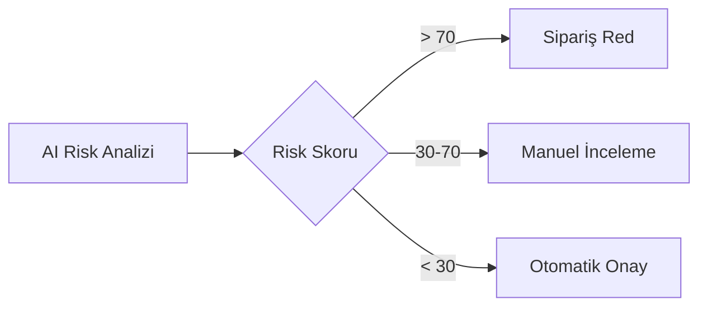
```mermaid
flowchart LR
    AI[AI Risk Analizi] --> Switch{Risk Skoru}
    Switch -->|> 70| Red[Sipariş Red]
    Switch -->|30-70| Manuel[Manuel İnceleme]
    Switch -->|< 30| Onay[Otomatik Onay]
```

#### Code Node'u

Code node'unda JavaScript yazarak özel dönüşümler yapabilirsiniz. Örneğin RFM skoru hesaplamak, stok yüzdesi hesaplamak veya veriyi filtrelemek gibi.

```javascript
// Örnek: Stok yüzdesi hesaplama
const item = $input.first().json;
const percentage = (item.currentStock / item.maxStock) * 100;
return [{
  json: {
    ...item,
    percentage: Math.round(percentage)
  }
}];
```

### 6.3 Veri Akışı Nasıl İlerler?

Her node, kendinden önceki node'dan gelen veriyi `$input` veya `$json` değişkenleriyle okur. İşlenen veri bir sonraki node'a iletilir.

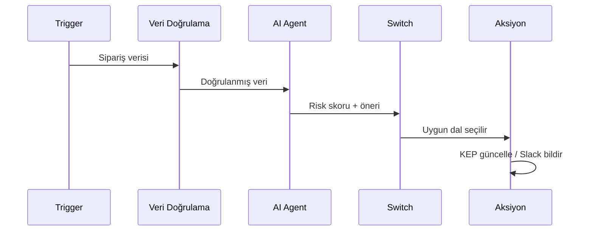
```mermaid
sequenceDiagram
    participant T as Trigger
    participant V as Veri Doğrulama
    participant AI as AI Agent
    participant S as Switch
    participant A as Aksiyon
    T->>V: Sipariş verisi
    V->>AI: Doğrulanmış veri
    AI->>S: Risk skoru + öneri
    S->>A: Uygun dal seçilir
    A->>A: KEP güncelle / Slack bildir
```

---

## 7. Mevcut AI Otomasyonlarının Detaylı Anlatımı

Bu bölümde, `n8n-docker/workflows/` klasöründe bulunan ve çalışmaya hazır olan 10 workflow tek tek anlatılacaktır. Her workflow için şunlar gösterilir:

- Genel amaç
- Ne zaman çalışır (tetikleyici)
- Adım adım akış
- Karar noktaları
- Örnek senaryo
- Beklenen çıktı

### 7.1 KEP (Kurumsal E-Ticaret Platformu)

KEP, enoca™ ekosisteminin merkezi platformudur. KEP workflow'ları sipariş, müşteri, stok ve güvenlik süreçlerini yönetir.

#### 7.1.1 KEP-AI-001: Akıllı Sipariş İşleme

**Amaç:** Yeni gelen siparişleri otomatik olarak risk analizine tabi tutup; düşük riskli olanları onaylamak, orta riskli olanları insan incelemesine göndermek, yüksek riskli olanları reddetmek.

**Tetikleyici:** Webhook — `POST /webhook/kep/siparis/yeni`

**Akış Diyagramı:**

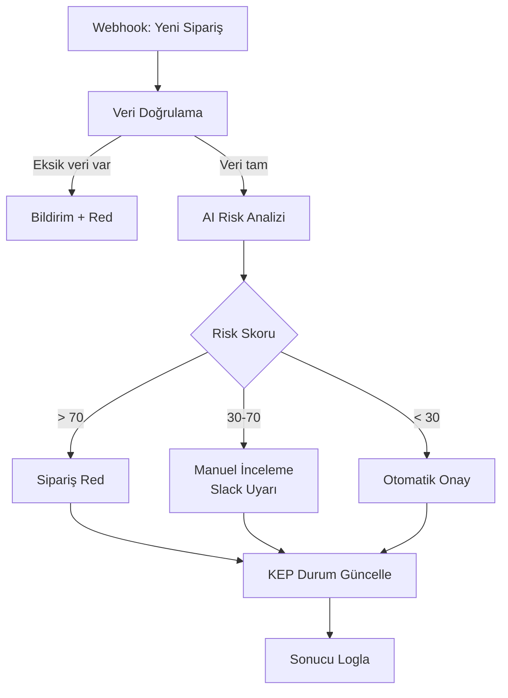
```mermaid
flowchart TD
    A[Webhook: Yeni Sipariş] --> B[Veri Doğrulama]
    B -->|Eksik veri var| C[Bildirim + Red]
    B -->|Veri tam| D[AI Risk Analizi]
    D --> E{Risk Skoru}
    E -->|> 70| F[Sipariş Red]
    E -->|30-70| G[Manuel İnceleme<br/>Slack Uyarı]
    E -->|< 30| H[Otomatik Onay]
    F --> I[KEP Durum Güncelle]
    G --> I
    H --> I
    I --> J[Sonucu Logla]
```

**Adım Adım Çalışma:**

1. **Webhook Trigger:** KEP sistemi yeni bir sipariş oluşturduğunda bu URL'ye POST isteği gönderir.
2. **Veri Doğrulama:** Gelen veride `musteriId`, `urunler` ve `toplamTutar` alanları kontrol edilir. Eksikse workflow durur.
3. **AI Risk Analizi:** Gemini'ye sipariş detayları verilir. Model, miktar anomalisi, fiyat tutarsızlığı ve müşteri geçmişini değerlendirir.
4. **Risk Skoru Değerlendirme:**
   - **> 70:** Yüksek risk → Sipariş reddedilir.
   - **30-70:** Orta risk → Slack kanalına manuel inceleme uyarısı gönderilir.
   - **< 30:** Düşük risk → Otomatik onaylanır.
5. **KEP Durum Güncelleme:** Karar KEP API'sine geri yazılır.
6. **Loglama:** Sonuç konsola ve log sistemine kaydedilir.

**Örnek Senaryo:**

> Yeni bir müşteri, 5 adet elektronik ürün için ₺45.000 tutarında sipariş veriyor. AI, "yeni müşteri + yüksek tutar + farklı şehir" kombinasyonunu yüksek risk olarak değerlendiriyor. Skor 75 çıkıyor ve sipariş otomatik reddediliyor. Güvenlik ekibi Slack üzerinden bilgilendiriliyor.

**Beklenen Fayda:**

| Metrik | Öncesi | Sonrası |
|--------|--------|---------|
| Manuel inceleme oranı | %35 | %8 |
| Sahte sipariş tespiti | %60 | %95 |
| Ortalama işlem süresi | 4.2 dk | 8 sn |

---

#### 7.1.2 KEP-AI-002: Dinamik Müşteri Segmentasyonu

**Amaç:** Her gece müşterileri RFM (Recency, Frequency, Monetary) ve CLV (Customer Lifetime Value) değerlerine göre otomatik segmentlere ayırmak ve segmente özel kampanyalar başlatmak.

**Tetikleyici:** Schedule (Cron) — Her gün saat 02:00

**Akış Diyagramı:**

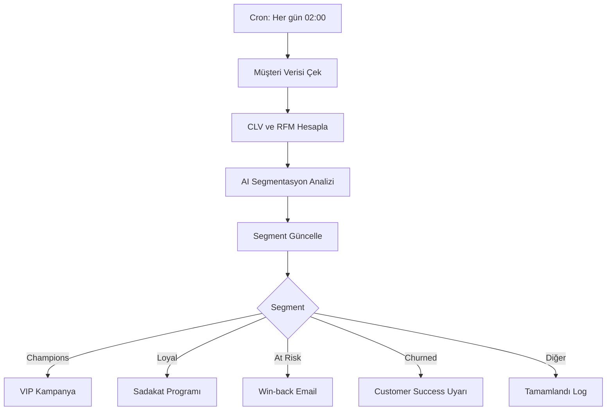
```mermaid
flowchart TD
    A[Cron: Her gün 02:00] --> B[Müşteri Verisi Çek]
    B --> C[CLV ve RFM Hesapla]
    C --> D[AI Segmentasyon Analizi]
    D --> E[Segment Güncelle]
    E --> F{Segment}
    F -->|Champions| G[VIP Kampanya]
    F -->|Loyal| H[Sadakat Programı]
    F -->|At Risk| I[Win-back Email]
    F -->|Churned| J[Customer Success Uyarı]
    F -->|Diğer| K[Tamamlandı Log]
```

**Adım Adım Çalışma:**

1. **Cron Trigger:** Her gece 02:00'de çalışır.
2. **Müşteri Verisi Çek:** Son 180 günün sipariş ve müşteri verileri PostgreSQL'den çekilir.
3. **CLV ve RFM Hesapla:** Code node'unda her müşteri için:
   - Recency: Son siparişten bu yana geçen gün
   - Frequency: Sipariş sayısı
   - Monetary: Toplam harcama
   - CLV: Tahmini yaşam boyu değer
   hesaplanır.
4. **AI Segmentasyon Analizi:** Gemini, segmentasyon sonuçlarını inceler ve iyileştirme önerileri sunar.
5. **Segment Güncelle:** Müşteri kayıtları `customers` tablosunda güncellenir.
6. **Kampanya Tetikle:** Segmente göre Slack kanallarına bildirim gönderilir.

**Segment Tanımları:**

| Segment | Kriter | Aksiyon |
|---------|--------|---------|
| Champions | RFM ≥ 12, sık alışveriş | VIP teklif, early access |
| Loyal | RFM 9-11 | Sadakat puanı bonusu |
| Active | Düzenli alışveriş | Standart kampanyalar |
| At Risk | Son sipariş > 60 gün | Win-back kampanyası |
| Churned | Son sipariş > 120 gün | Customer success iletişimi |
| Potential | Yeni müşteri, 1-2 sipariş | Onboarding kampanyası |

---

#### 7.1.3 KEP-AI-003: Stok Uyarı ve Restok

**Amaç:** Kritik stok seviyelerini izlemek, AI destekli restok önerileri üretmek ve gerekirse otomatik satın alma talebi oluşturmak.

**Tetikleyici:** Schedule (Cron) — Günde 3 kez (06:00, 12:00, 18:00)

**Akış Diyagramı:**

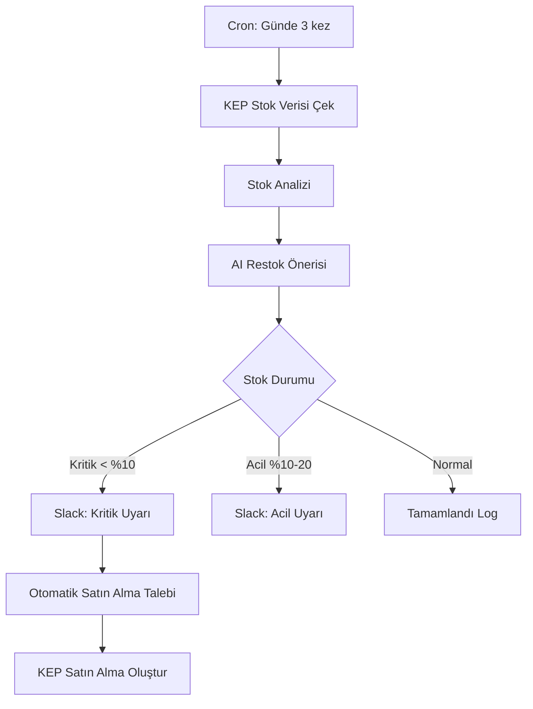
```mermaid
flowchart TD
    A[Cron: Günde 3 kez] --> B[KEP Stok Verisi Çek]
    B --> C[Stok Analizi]
    C --> D[AI Restok Önerisi]
    D --> E{Stok Durumu}
    E -->|Kritik < %10| F[Slack: Kritik Uyarı]
    E -->|Acil %10-20| G[Slack: Acil Uyarı]
    E -->|Normal| H[Tamamlandı Log]
    F --> I[Otomatik Satın Alma Talebi]
    I --> J[KEP Satın Alma Oluştur]
```

**Adım Adım Çalışma:**

1. **Cron Trigger:** Belirlenen saatlerde çalışır.
2. **Stok Verisi Çek:** KEP API'den envanter verisi alınır.
3. **Stok Analizi:** Her ürün için stok yüzdesi, günlük ortalama satış ve tükenme tahmini hesaplanır.
4. **AI Restok Önerisi:** Gemini, her kritik ürün için optimal sipariş miktarı, aciliyet ve tedarikçi önerisi sunar.
5. **Duruma Göre Yönlendirme:**
   - **Kritik (%10 altı):** Slack'e acil uyarı + otomatik satın alma talebi.
   - **Acil (%10-20):** Slack'e uyarı.
   - **Normal:** Sadece loglanır.
6. **Satın Alma Oluştur:** Kritik ürünler için KEP'e satın alma emri gönderilir.

**AI Karar Matrisi:**

| Stok % | Durum | Aksiyon | SLA |
|--------|-------|---------|-----|
| > %50 | Sağlıklı | Log | - |
| %20-50 | Uyarı | Monitoring | 48 saat |
| %10-20 | Kritik | Otomatik sipariş | 24 saat |
| < %10 | Acil | Acil sipariş + bildirim | 4 saat |

---

#### 7.1.4 KEP-AI-004: RBAC Audit ve Güvenlik

**Amaç:** Kullanıcı erişim loglarını analiz ederek şüpheli davranışları tespit etmek ve yüksek riskli durumlarda otomatik hesap kilitleme yapmak.

**Tetikleyici:** Schedule (Cron) — Her gün saat 01:00

**Akış Diyagramı:**

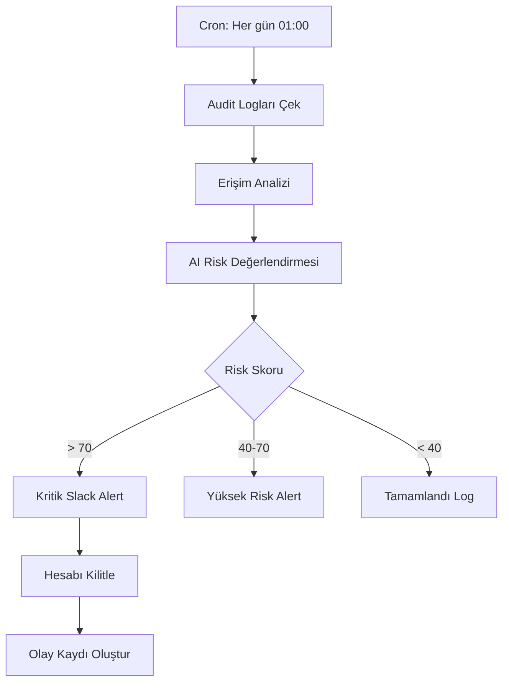
```mermaid
flowchart TD
    A[Cron: Her gün 01:00] --> B[Audit Logları Çek]
    B --> C[Erişim Analizi]
    C --> D[AI Risk Değerlendirmesi]
    D --> E{Risk Skoru}
    E -->|> 70| F[Kritik Slack Alert]
    E -->|40-70| G[Yüksek Risk Alert]
    E -->|< 40| H[Tamamlandı Log]
    F --> I[Hesabı Kilitle]
    I --> J[Olay Kaydı Oluştur]
```

**İzlenen Anomaliler:**

| Olay | Eşik | Aksiyon |
|------|------|---------|
| Mesai dışı hassas işlem | 22:00-08:00 arası DELETE/EXPORT/ADMIN | Yüksek risk uyarısı |
| Toplu kullanıcı export'u | > 1000 kayıt | Kritik uyarı |
| Başarısız login patlaması | > 5 deneme/saat | Hesap kilitleme |
| Ödeme verisi erişimi | Standart dışı saat | Audit log + bildirim |

**Adım Adım Çalışma:**

1. Son 24 saatin audit logları çekilir.
2. Önceden tanımlı kurallarla anomali tespiti yapılır.
3. AI, anomalilerin risk skorunu ve aksiyon önerisini verir.
4. Kritik risk durumunda hesap otomatik kilitlenir ve security_incidents tablosuna kayıt atılır.

---

### 7.2 Connector

Connector, KEP ile pazaryerleri (Trendyol, Hepsiburada, Amazon) arasında köprü görevi görür.

#### 7.2.1 CONN-AI-001: Otomatik Ürün Eşleştirme

**Amaç:** Farklı platformlardan gelen ürünleri, barkod, isim, marka ve kategori benzerliğine göre KEP ürün kataloğuyla eşleştirmek.

**Tetikleyici:** Webhook — `POST /webhook/connector/product/new`

**Akış Diyagramı:**

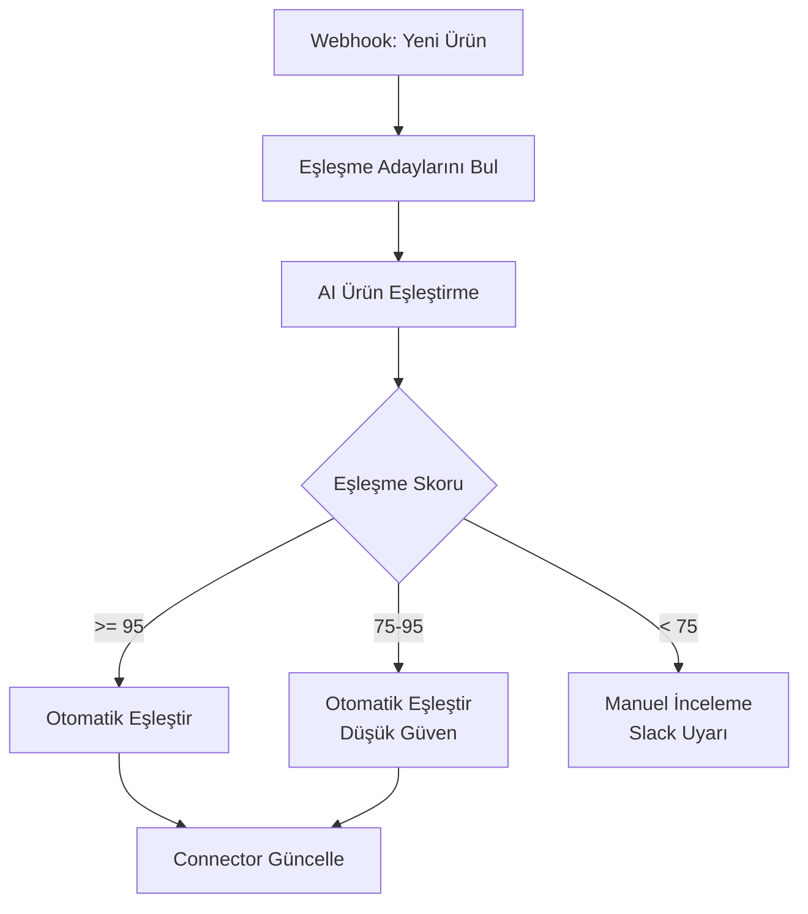
```mermaid
flowchart TD
    A[Webhook: Yeni Ürün] --> B[Eşleşme Adaylarını Bul]
    B --> C[AI Ürün Eşleştirme]
    C --> D{Eşleşme Skoru}
    D -->|>= 95| E[Otomatik Eşleştir]
    D -->|75-95| F[Otomatik Eşleştir<br/>Düşük Güven]
    D -->|< 75| G[Manuel İnceleme<br/>Slack Uyarı]
    E --> H[Connector Güncelle]
    F --> H
```

**Eşleştirme Stratejisi:**

| Seviye | Metot | Confidence | Kullanılan Alanlar |
|--------|-------|------------|--------------------|
| 1 | Barkod tam eşleşme | %100 | barcode, sku, gtin |
| 2 | AI semantik eşleşme | %85+ | name, brand, category |
| 3 | Manuel inceleme | - | Görsel + insan kontrolü |

**Skorlama:**

- Barkod tam eşleşmesi: +40 puan
- İsim benzerliği: +30 puan
- Marka eşleşmesi: +15 puan
- Kategori eşleşmesi: +15 puan

---

#### 7.2.2 CONN-AI-002: Envanter Senkronizasyonu

**Amaç:** KEP'teki stok verisini Trendyol ve Hepsiburada ile senkronize tutmak; uyuşmazlık varsa bildirim göndermek.

**Tetikleyici:** Schedule (Cron) — Her 15 dakikada bir

**Akış Diyagramı:**

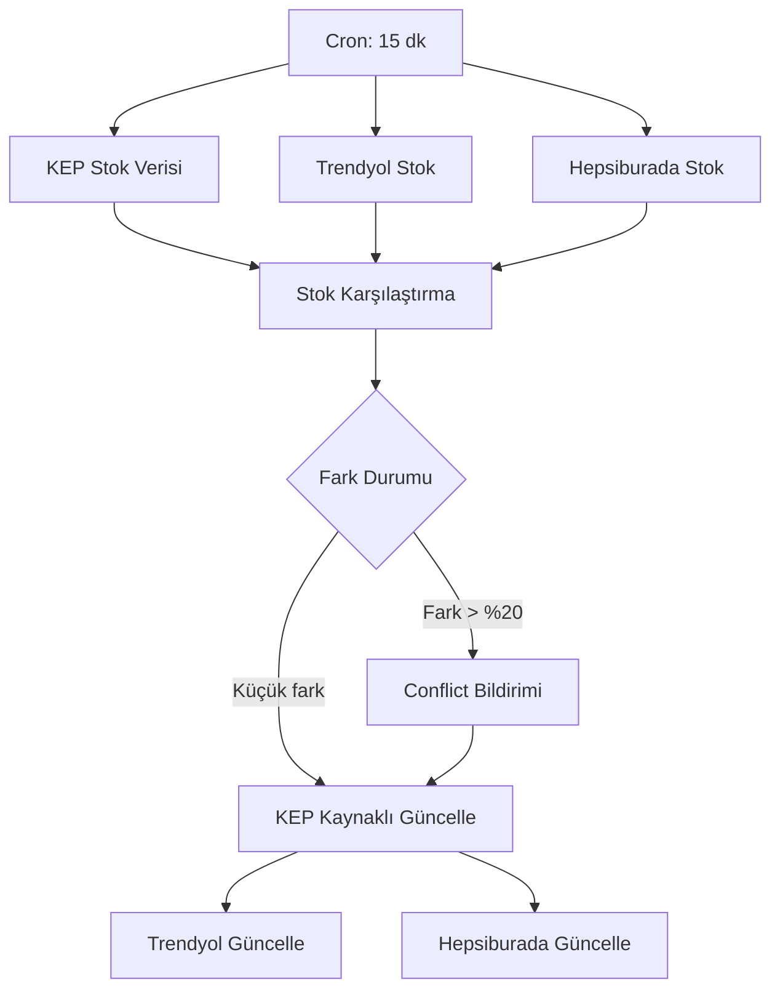
```mermaid
flowchart TD
    A[Cron: 15 dk] --> B[KEP Stok Verisi]
    A --> C[Trendyol Stok]
    A --> D[Hepsiburada Stok]
    B --> E[Stok Karşılaştırma]
    C --> E
    D --> E
    E --> F{Fark Durumu}
    F -->|Fark > %20| G[Conflict Bildirimi]
    F -->|Küçük fark| H[KEP Kaynaklı Güncelle]
    G --> H
    H --> I[Trendyol Güncelle]
    H --> J[Hepsiburada Güncelle]
```

**Senkronizasyon Kuralları:**

| Senaryo | Aksiyon |
|---------|---------|
| KEP:100, Trendyol:50 | Trendyol'u 100 yap |
| KEP:100, Trendyol:120 | Anomali, logla ve bildir |
| KEP:0, Trendyol:50 | Tüm platformlara 0 uygula |

---

### 7.3 EnoPrice

#### 7.3.1 ENOPRICE-AI-001: Rakip Fiyat İzleme

**Amaç:** Trendyol, Hepsiburada ve Amazon'daki rakip fiyatlarını saatlik izlemek, fiyat avantajı/dezavantajı durumunda yöneticiyi bilgilendirmek.

**Tetikleyici:** Schedule (Cron) — Saatlik

**Akış Diyagramı:**

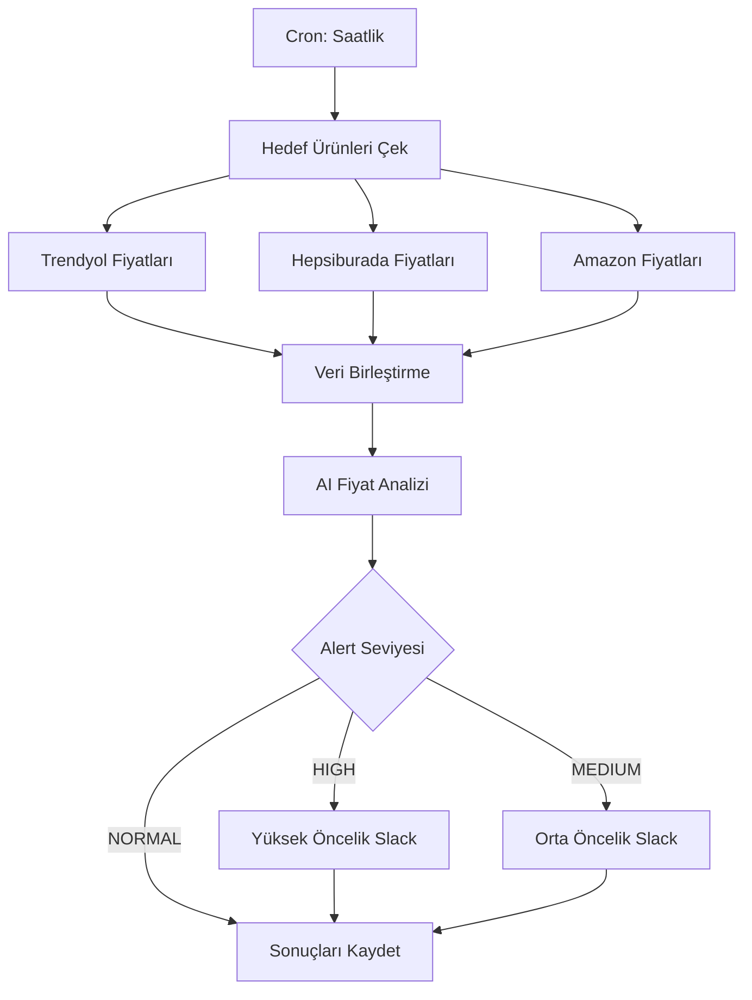
```mermaid
flowchart TD
    A[Cron: Saatlik] --> B[Hedef Ürünleri Çek]
    B --> C[Trendyol Fiyatları]
    B --> D[Hepsiburada Fiyatları]
    B --> E[Amazon Fiyatları]
    C --> F[Veri Birleştirme]
    D --> F
    E --> F
    F --> G[AI Fiyat Analizi]
    G --> H{Alert Seviyesi}
    H -->|HIGH| I[Yüksek Öncelik Slack]
    H -->|MEDIUM| J[Orta Öncelik Slack]
    H -->|NORMAL| K[Sonuçları Kaydet]
    I --> K
    J --> K
```

**Hesaplanan Metrikler:**

- Minimum rakip fiyatı
- Ortalama rakip fiyatı
- Fiyat farkı (TL ve %)
- Önerilen yeni fiyat
- Alert seviyesi (HIGH / MEDIUM / LOW)

**Örnek Çıktı:**

```json
{
  "productId": "12345",
  "sku": "ABC-001",
  "ourPrice": 1500,
  "minCompetitorPrice": 1399,
  "priceGapPercent": 7.2,
  "suggestedPrice": 1449,
  "alert": "MEDIUM"
}
```

---

### 7.4 EnoRep

#### 7.4.1 ENOREP-AI-001: Kişiselleştirilmiş Sepet Terk Emaili

**Amaç:** Sepetini terk eden müşterilere, AI tarafından kişiselleştirilmiş email göndermek.

**Tetikleyici:** Schedule (Cron) — Günde 4 kez (06:00, 12:00, 18:00, 22:00)

**Akış Diyagramı:**

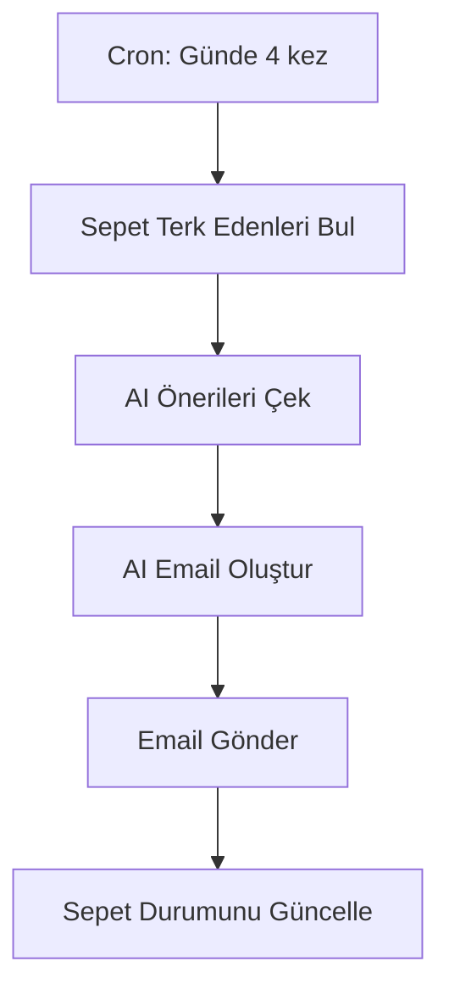
```mermaid
flowchart TD
    A[Cron: Günde 4 kez] --> B[Sepet Terk Edenleri Bul]
    B --> C[AI Önerileri Çek]
    C --> D[AI Email Oluştur]
    D --> E[Email Gönder]
    E --> F[Sepet Durumunu Güncelle]
```

**Email İçeriği:**

- Konu satırı (max 60 karakter)
- Kişisel ön yazı
- Sepetteki ürün vurgusu
- Scarcity / urgency mesajı
- CTA butonu
- Footer

**Örnek Prompt Çıktısı:**

```json
{
  "subject": "Ahmet, sepetindeki ürünler seni bekliyor 🛒",
  "preheader": "48 saat içinde tamamla, kargo bedava!",
  "body": "Merhaba Ahmet, PS5 Controller ve Gaming Mouse ürünlerini sepetine eklemiştin...",
  "cta": "Sepetimi Tamamla"
}
```

> **Not:** Emoji kullanımı profesyonel dokümantasyonda önerilmez; yukarıdaki örnek sadece içeriği göstermek içindir.

---

#### 7.4.2 ENOREP-AI-002: CLV Tahmini ve Churn Önleme

**Amaç:** Churn riski taşıyan müşterileri tespit edip, kişiselleştirilmiş geri kazanım kampanyaları başlatmak.

**Tetikleyici:** Schedule (Cron) — Her pazartesi 09:00

**Akış Diyagramı:**

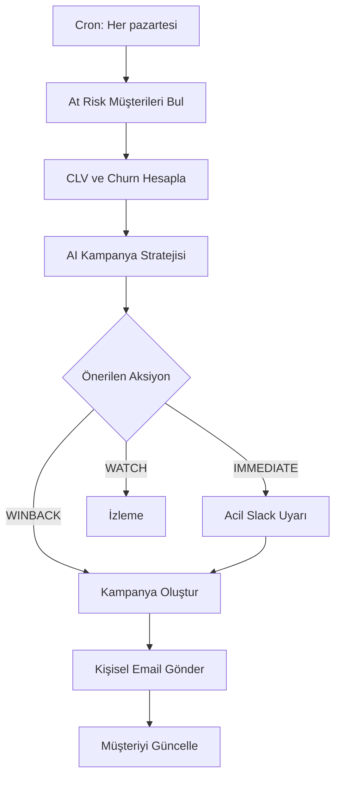
```mermaid
flowchart TD
    A[Cron: Her pazartesi] --> B[At Risk Müşterileri Bul]
    B --> C[CLV ve Churn Hesapla]
    C --> D[AI Kampanya Stratejisi]
    D --> E{Önerilen Aksiyon}
    E -->|IMMEDIATE| F[Acil Slack Uyarı]
    E -->|WINBACK| G[Kampanya Oluştur]
    E -->|WATCH| H[İzleme]
    F --> G
    G --> I[Kişisel Email Gönder]
    I --> J[Müşteriyi Güncelle]
```

**Risk Skoru Hesaplama:**

- Recency (son siparişten bu yana geçen süre): max 40 puan
- Engagement (email açılma oranı): max 30 puan
- Frequency (düşük sipariş sayısı): max 30 puan

**Aksiyon Eşikleri:**

| Risk Skoru | Seviye | Aksiyon |
|------------|--------|---------|
| ≥ 80 | Çok yüksek | Acil müdahale + kişisel email |
| 60-79 | Yüksek | Win-back kampanyası |
| 40-59 | Orta | Re-engagement email |
| < 40 | Düşük | İzleme |

---

### 7.5 EnoCart

#### 7.5.1 ENOCART-AI-001: Hırsızlık / Sahtekarlık Tespiti

**Amaç:** Akıllı alışveriş arabasından gelen sensör verilerini analiz ederek hırsızlık veya sahtekarlık girişimlerini gerçek zamanlı tespit etmek.

**Tetikleyici:** MQTT — `enocart/session/+/sensors`

**Akış Diyagramı:**

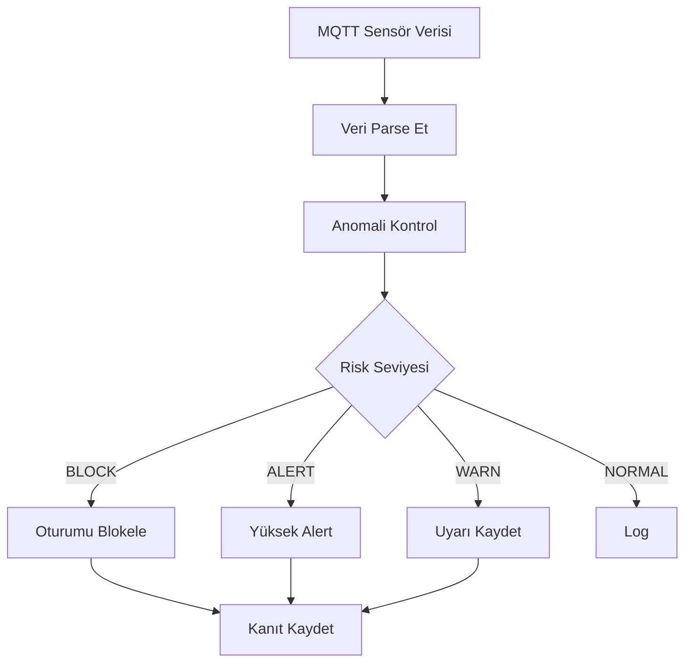
```mermaid
flowchart TD
    A[MQTT Sensör Verisi] --> B[Veri Parse Et]
    B --> C[Anomali Kontrol]
    C --> D{Risk Seviyesi}
    D -->|BLOCK| E[Oturumu Blokele]
    D -->|ALERT| F[Yüksek Alert]
    D -->|WARN| G[Uyarı Kaydet]
    D -->|NORMAL| H[Log]
    E --> I[Kanıt Kaydet]
    F --> I
    G --> I
```

**Tespit Edilen Anomaliler:**

| Anomali Tipi | Açıklama | Eşik |
|--------------|----------|------|
| Ağırlık uyuşmazlığı | Barkod okutulan ürün ile tartılan ağırlık farklı | > 50g |
| Hızlı tarama | Çok hızlı ürün okutma | < 1.5 sn/ürün |
| Tarama atlaması | Fiziksel sayı ile okutulan sayı arası fark | > %15 |
| Bilinmeyen ürün | Sistemde kayıtlı olmayan barkod | - |
| Şüpheli pozisyon | Kamera + ağırlık uyuşmazlığı | - |

**Aksiyonlar:**

- **BLOCK:** Oturum MQTT üzerinden durdurulur, kritik Slack alerti gönderilir.
- **ALERT:** Güvenlik ekibi bilgilendirilir, kayıt altına alınır.
- **WARN:** Sadece loglanır.

---

## 8. Workflow'ları n8n'e Yükleme ve Test Etme

### 8.1 Workflow JSON Dosyalarının Konumu

Tüm workflow şablonları şu klasörlerdedir:

```
n8n-docker/workflows/
├── kep/
├── connector/
├── enoprice/
├── enorep/
└── enocart/
```

### 8.2 n8n UI Üzerinden Import Etme

1. n8n editöründe sağ üst köşedeki **More actions** menüsünü açın.
2. **Import from File** seçeneğini seçin (n8n sürümünüze bağlı olarak menüde yer alabilir).
3. İlgili `.json` dosyasını seçin.
4. Workflow yüklendikten sonra **Publish** butonuna basarak aktif hale getirin.

> **Not:** n8n'in yeni sürümlerinde bazı eski bağlantı formatlarını otomatik dönüştürebilir. Eğer import sırasında uyarı alırsanız, node'ları ve bağlantıları kontrol edin.

### 8.3 n8n CLI ile Toplu Import (Gelişmiş)

Container ortamında toplu import yapmak isterseniz:

```bash
# Tüm JSON'ları tek klasöre kopyala
docker exec enoca_n8n sh -c "mkdir -p /tmp/workflows && find /home/node/workflows -name '*.json' -exec cp {} /tmp/workflows \;"

# Import et
docker exec enoca_n8n n8n import:workflow --separate --input=/tmp/workflows
```

> **Uyarı:** Mevcut JSON dosyalarındaki bağlantı formatı n8n'in en yeni sürümleriyle tam uyumlu olmayabilir. Bu durumda UI üzerinden manuel import daha güvenlidir.

### 8.4 Manuel Test Etme

Her workflow'u test etmek için:

1. Workflow editöründe **Execute Workflow** (sağ üstte "Test workflow") butonuna basın.
2. Eğer workflow webhook ile tetikleniyorsa, sağ üstteki **Webhook URL**'yi kopyalayın ve bir araçla (Postman, curl) POST isteği gönderin.

Örnek curl komutu (KEP-AI-001 için):

```bash
curl -X POST http://localhost:5678/webhook/kep/siparis/yeni \
  -H "Content-Type: application/json" \
  -d '{
    "musteriId": "cust_123",
    "urunler": [{"id": "p1", "adet": 2}],
    "toplamTutar": 1500
  }'
```

3. Çalışma sonucunu **Executions** ekranından kontrol edin.

---

## 9. Güvenlik ve En İyi Uygulamalar

### 9.1 API Anahtarlarını Güvenli Saklama

Workflow JSON dosyalarına asla gerçek API anahtarı yazmayın. Bunun yerine:

1. n8n Settings > Credentials bölümüne gidin.
2. Her servis için ayrı bir credential oluşturun.
3. Workflow'da ilgili node'un authentication alanında bu credential'ı seçin.

### 9.2 .env Dosyasını Koruma

`.env` dosyası commit edilmemelidir. Proje kökünde `.gitignore` dosyası oluşturun:

```gitignore
.env
*.env
.DS_Store
node_modules/
__pycache__/
*.log
```

### 9.3 Webhook Güvenliği

Webhook URL'leri dışarıya açık olduğunda:

- Rastgele, tahmin edilemez path'ler kullanın.
- İsteğin gerçekten beklenen kaynaktan geldiğini doğrulayın (IP whitelist, imza kontrolü).
- Production ortamında HTTPS zorunlu tutun.

### 9.4 Rate Limiting

Dış API'lere (Trendyol, Hepsiburada, Gemini) çok sayıda istek göndermemek için:

- Workflow'ların cron aralıklarını makul tutun.
- n8n'de Split In Batches node'u ile toplu işlemleri parçalayın.
- Retry politikaları tanımlayın.

### 9.5 Hata Yönetimi

Her workflow'a hata durumunda çalışacak bir **Error Workflow** bağlanabilir. Hata oluştuğunda:

- Slack/email ile bildirim gönderilir.
- Hata detayları loglanır.
- İşlem retry kuyruğuna alınabilir.

---

## 10. Hata Ayıklama ve Loglama

### 10.1 Executions Ekranından Kontrol

Bir workflow hatalı çalıştığında:

1. Sol menüden **Executions**'a gidin.
2. Hatalı çalışmayı bulun (kırmızı işaretli).
3. Üzerine tıklayın.
4. Hata alan node'u ve mesajını inceleyin.

### 10.2 Docker Logları

Konteyner loglarını görmek için:

```bash
# Tüm servislerin logları
docker-compose logs -f

# Sadece n8n logları
docker-compose logs -f n8n

# PostgreSQL logları
docker-compose logs -f postgres
```

### 10.3 Sık Karşılaşılan Hatalar

| Hata | Olası Neden | Çözüm |
|------|-------------|-------|
| `Unauthorized` | API anahtarı eksik veya hatalı | `.env` dosyasını ve credential'ları kontrol edin |
| `Connection refused` | n8n veya PostgreSQL çalışmıyor | `docker-compose ps` ile sağlık durumunu kontrol edin |
| `Workflow structure is invalid` | JSON bağlantı formatı uyumsuz | Node bağlantılarını manuel kontrol edin |
| `Timeout` | AI API yavaş yanıt veriyor | `EXECUTIONS_TIMEOUT` değerini artırın veya retry ekleyin |
| `Rate limit exceeded` | Çok fazla API çağrısı | Cron aralığını uzatın veya batch işlem yapın |

---

## 11. Sık Sorulan Sorular

**S: n8n'e erişim sağlayamıyorum, ne yapmalıyım?**
C: `docker-compose ps` komutuyla servislerin çalıştığından emin olun. Ardından tarayıcınızda `http://localhost:5678` adresini deneyin.

**S: Yeni bir workflow nasıl eklerim?**
C: `n8n-docker/workflows/` altına uygun proje klasörüne `{PROJE}-AI-{NNN}_{Açıklama}.json` formatında bir dosya ekleyin. Ardından n8n UI'dan import edin.

**S: AI Agent node'u çalışmıyor, neden?**
C: `.env` dosyasındaki `AI_GEMINI_API_KEY` değerinin doğru olduğundan ve n8n credential'ına tanımlandığından emin olun.

**S: Workflow'ları otomatik olarak n8n'e yükleyebilir miyim?**
C: n8n CLI ile toplu import yapılabilir. Ancak JSON formatının n8n sürümünüzle uyumlu olması gerekir.

**S: Production'da farklı ne yapmalıyım?**
C: HTTPS kullanın, güçlü şifreler belirleyin, API anahtarlarını credential olarak saklayın, monitoring profilini aktif edin ve düzenli yedekleme yapın.

---

## 12. Ekler

### 12.1 Terimler Sözlüğü

| Terim | Açıklama |
|-------|----------|
| **Agent** | Belirli bir görevi yerine getiren yapay zeka bileşeni |
| **CLV** | Customer Lifetime Value — Müşteri yaşam boyu değeri |
| **Cron** | Belirli zaman aralıklarında çalışan zamanlayıcı |
| **KPI** | Key Performance Indicator — Ana performans göstergesi |
| **MQTT** | IoT cihazları için hafif mesajlaşma protokolü |
| **RFM** | Recency, Frequency, Monetary — Müşteri segmentasyon modeli |
| **ROI** | Return on Investment — Yatırım getirisi |
| **Webhook** | Bir olay gerçekleştiğinde dış sisteme HTTP isteği gönderen mekanizma |
| **Workflow** | Otomasyon adımlarının bir araya geldiği yapı |

### 12.2 Faydalı Komutlar

```bash
# Servisleri başlat
docker-compose up -d

# Servisleri durdur
docker-compose down

# Logları izle
docker-compose logs -f n8n

# Workflow'ları CLI ile import et
docker exec enoca_n8n n8n import:workflow --separate --input=/tmp/workflows

# Container içine gir
docker exec -it enoca_n8n /bin/sh
```

### 12.3 Referanslar

- n8n Resmi Dokümantasyonu: https://docs.n8n.io/
- Google Gemini API: https://ai.google.dev/
- Docker Compose Referansı: https://docs.docker.com/compose/
- Mevcut ana dokümantasyon: `ENOCA_AI_Otomasyon_Dokumantasyonu.md`

### 12.4 Versiyon Geçmişi

| Versiyon | Tarih | Yazar | Değişiklikler |
|----------|-------|-------|---------------|
| 1.0 | 25.06.2026 | enoca AR-GE | İlk ana dokümantasyon |
| 2.0 | 06.07.2026 | enoca AR-GE | Kullanıcı rehberi, ekran görüntüleri, adım adım kurulum, Mermaid diyagramları eklendi |

---

*Bu doküman, enoca™ AI Otomasyon Sistemi'nin sürekli güncellenen bir rehberidir. Yeni workflow'lar eklendikçe veya sistemde değişiklik yapıldıkça güncellenmelidir.*
